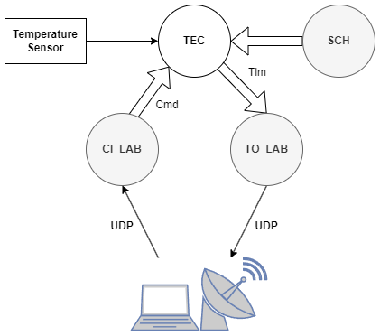
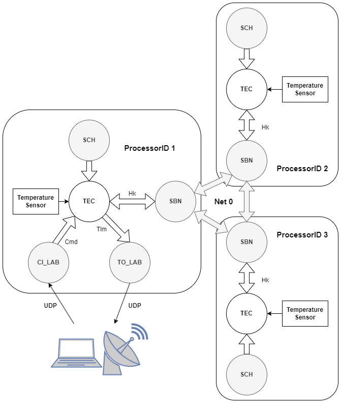

## Introduction

This Repository (and the oncluded submodules) contains an implementation of a triple core system that independently read out a (fake) temperature and shares this data to the other nodes via the SBN.
Each node performs a majority voting on the selected temperature.
CPU 1 sends out the house keeping data via the TO_LAB app.

## How to get started

Run the setup script to autmatically set up the repositories and the Cmake environment and build the system.
```
./setup.sh
make install
```

## Single Processor Example

(Optinally:) Check out the branch `single-core` for a continous random temperature value. The `main` branch only provides a constant temperature value.



Run the processor
```
cd build/exe/cpu1
./core-cpu1
```

Start the ground system GUI in another terminal
```
cd tools/cFS-GroundSystem
python3 GroundSystem.py
```

Select `Start Command System`, click on `Enable Tlm` and enter `127.0.0.1` as dest_IP parameter and send the command.

Now, after clicking the `Start Telemetry System` button you should see the TEC HK (TEC app house keeping) counter increasing. Clicking on `Display Page` we can see the counters and also the temperature with the temperature unit.

To change the house keeping temperature unit to Fahrenheit, open another terminal and manually send the command like this:
```
./build/exe/host/cmdUtil --endian=LE --pktid=0x1890 --cmdcode=4 --string=1:F
```

Change it back to Celsius
```
./build/exehost/cmdUtil --endian=LE --pktid=0x1890 --cmdcode=4 --string=1:C
```

## Multi Processor Example



In the targets.cmake we now have defined 3 different targets, called cpu1, cpu2, cpu3.
Each target can have a different applist. Apps listed under MISSION_GLOBAL_APPLIST are common to all targets.

By placing a file `cpu<n>_cfe_es_startup.scr` we can define the startup script for each target separately.

After following the normal build steps, start all 3 processors.

```
cd build/exe/cpu<n>
./core-cpu<n>
```

Each processor has a different Message ID, so to send the command to a specific processor its important to use the correct packet ID.
The `default_tec_msgids.h` is overwritten with the `cpu<n>_tec_msgids.h` placed in the `sample_defs` directory.

```
# cpu1
./build/exe/host/cmdUtil --endian=LE --pktid=0x1890
# cpu2
./build/exe/host/cmdUtil --endian=LE --pktid=0x1893
# cpu 3
./build/exe/host/cmdUtil --endian=LE --pktid=0x1896
```

By default the TEC app sends the house keeping temperature in Celsius.
The voting algorithm doesnt check the unit of the temperature on purpose. This way we can inject an error and test the voting algorithm.

For example we can instruct CPU2 to send its Hk temperature in Fahrenheit instead of Celsius.
Issue the related command:

```
# cpu2: Convert temperature to F
./build/exe/host/cmdUtil --endian=LE --pktid=0x1893 --cmdcode=4 --string=1:F
```

Now we should see that CPU2 identifies itself as a faulty node, because it lost the majority vote.
